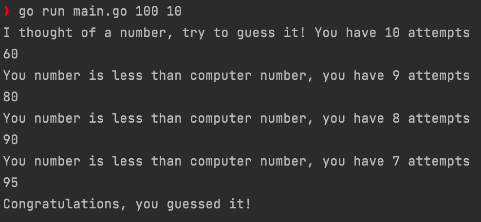

# Guess number game

## Rules
Computer has thought of some integer number. You must guess it, you have `numberOfAttempts` attempts.

## How to run
Just type in console
```bash
go run main.go <maxNumber> <numberOfAttempts>
```
`maxNumber` and `numberOfAttempts` must be integers.

## Example
